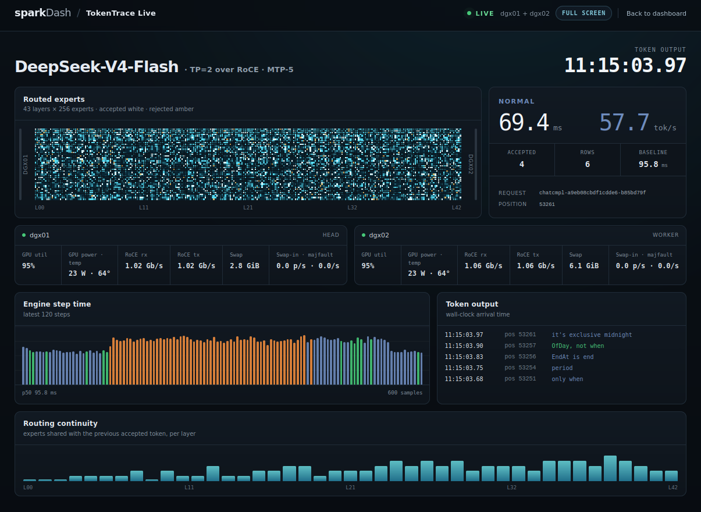
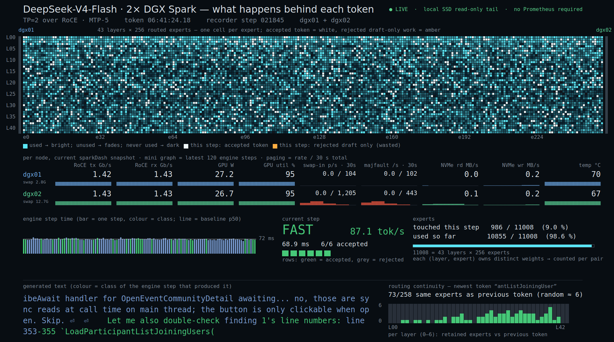

# ultra-sparkdash

`ultra-sparkdash` は、DeepSeek-V4-Flash の推論中に記録される routed
expert情報を、sparkDash上でリアルタイム表示するための配布用メタリポジトリです。
実装を混ぜず、次の2つのforkをsubmoduleとして同時に固定します。

| Submodule | 役割 |
|---|---|
| [`sparkDash`](./sparkDash) | TokenTrace Live UI、read-only tailer、DGXメトリクス、optionalなPrometheus/InfluxDB exporter |
| [`DeepSeek-v4-Flash-DSpark-2x-DGX-Spark`](./DeepSeek-v4-Flash-DSpark-2x-DGX-Spark) | vLLM V2 runner側のexpert-routing recorderと、subscriber接続時の短周期flush |

通常のsparkDash機能はそのまま利用できます。TokenTrace Liveは
DeepSeek-V4-Flash、TP=2 over RoCE、MTP-5構成向けの追加機能です。

ブラウザの通常表示では、43層 × 256 routed expertsの利用状況とaccepted / rejected
workを中心に、engine step time、tok/s、実token出力、routing continuity、2台の
DGX SparkのGPU・RoCE・paging・NVMe状態を同じ時系列で追えます。

[](./docs/images/tokentrace-live-dashboard.png)

*TokenTrace Liveの通常表示。最新tokenと、そのtokenを生成した推論step・expert routing・machine stateを対応付けて表示します。*

fullscreenでは、同じlive streamを元の動画generatorに近いFHD canvasへ再構成します。
壁面表示や画面収録では、expert map、nodeごとのpaging、step class、生成text、
routing continuityを一画面で確認できます。

[](./docs/images/tokentrace-fhd-fullscreen.png)

*動画generator由来のFHD fullscreen表示。Prometheusなしでもlocal SSDのread-only tailだけで主要なTokenTrace表示が動作します。*

## Clone

```bash
git clone --recurse-submodules https://github.com/muojp/ultra-sparkdash.git
cd ultra-sparkdash
git submodule status
```

submoduleを付けずにcloneした場合は次を実行します。

```bash
git submodule update --init --recursive
```

このリポジトリは各submoduleのcommitを固定します。`git pull`後は必ず
`git submodule update --init --recursive`を実行してください。

## 構成とデータ経路

```text
DeepSeek / vLLM V2 runner (Head DGX)
  └─ ~/.cache/huggingface/tokentrace/
       ├─ experts-*.idx.jsonl
       └─ experts-*.u8
              │ read-only tail + shared flock
              ▼
same-host sparkDash :5555
  ├─ /tokentrace                         browser UI
  ├─ local Head metrics                  /proc, /sys, nvidia-smi
  └─ Worker metrics                      persistent SSH session
```

expert-routingファイルはHeadのローカルSSDから読みます。この経路にSSH、
Grafana、Prometheus、InfluxDBは不要です。一方、Worker側のGPU/RoCE/NVMe/
pagingメトリクスを表示するには、通常のsparkDashと同様にHeadからWorkerへの
SSH接続が必要です。

ブラウザがTokenTraceへsubscribeしている間だけtailerがファイルを開きます。
read-only descriptorにshared lockを付けると、DeepSeek recorderはflush間隔を
通常の2秒から50 msへ短縮します。最後のsubscriberが切断すると通常間隔へ
戻ります。

## 前提環境

- HeadとWorkerの2台構成。Head上でDeepSeekとsparkDashを動かす
- Head/Worker間のRoCEとTP=2推論環境が構築済み
- HeadからWorkerへ非対話SSHできること。key auth推奨
- HeadにDocker Engine + Compose plugin、またはNode.js 22
- 実ファイルtailにはLinuxの`flock`（util-linux）が必要
- sparkDashのHead unitを **Local / Head**、WorkerをそのHeadへlinked設定

モデル・NCCL・コンテナの準備は
[`DeepSeek-v4-Flash-DSpark-2x-DGX-Spark/README.md`](./DeepSeek-v4-Flash-DSpark-2x-DGX-Spark/README.md)
を参照してください。

## sparkDashの起動

```bash
cd sparkDash
cp .env.example .env
docker compose up -d --build sparkdash
```

標準Composeはhost network、host PID namespace、`/proc`、`/sys`、ホストrootの
read-only mountを使用します。ホストのLLMが`127.0.0.1` bindでも、コンテナ内の
sparkDashから到達できます。

別端末からUIへ接続する場合は`.env`で`BIND_HOST`をHeadのLAN IPまたは
`0.0.0.0`にします。sparkDashは認証なしでSSH・電源操作APIを持つため、公開
インターネットへbindせず、信頼できるLANまたは認証付きreverse proxy内に
限定してください。

### Worker SSH key

SSHはsparkDashコンテナ内で実行されます。ホストの鍵を自動では参照しません。
必要に応じて[`sparkDash/docker-compose.yml`](./sparkDash/docker-compose.yml)の
SSH key volumeを有効化し、デフォルト名でmountするか`.env`にコンテナ内パスを
指定します。

```dotenv
SSH_IDENTITY_FILE=/root/.ssh/id_ed25519
```

Head/WorkerをUIへ登録後、Headは`Local`かつ`Head`、Workerは`Worker`かつ
`workerHeadId`がそのHeadを指す状態にしてください。複数clusterがある場合は
次で対象を固定できます。

```dotenv
TOKENTRACE_HEAD_ID=<sparkDash Head id>
```

## DeepSeek recorder

DeepSeek側でexpert-routing recorderを有効化して推論サーバーを起動します。

```dotenv
DSPARK_TOKENTRACE_EXPERTS=1
```

標準の出力先はHeadユーザーの
`~/.cache/huggingface/tokentrace`です。sparkDash Composeはホストrootを
`/host/root:ro`へmountし、Head unitのSSH userから
`/host/root/home/<user>/.cache/huggingface/tokentrace`を推定します。rootや
非標準home、別SSDを使う場合は、コンテナから見えるread-onlyパスを明示します。

```dotenv
TOKENTRACE_DIR=/host/root/path/to/tokentrace
```

表示URLは次です。

```text
http://<Head LAN IP>:5555/tokentrace
```

## Token output

既定の`metadata` modeはtoken IDを文字列化せず、routing metadataだけを表示
します。実tokenを表示する場合は、同じHeadのOpenAI-compatible serverが
`/detokenize`を提供していることを確認し、`.env`へ設定します。

```dotenv
TOKENTRACE_TOKEN_OUTPUT=detokenize
TOKENTRACE_MODEL=deepseek-v4-flash-0731
TOKENTRACE_DETOKENIZE_URL=http://127.0.0.1:8888/detokenize
```

Composeは`.env`を単なる置換ファイルとして読むため、`sparkDash` forkのCompose
では`TOKENTRACE_*`、exporter、polling関連の変数を明示的にコンテナへ転送して
います。

## Grafana / Prometheus / InfluxDB

すべてoptionalで、TokenTrace Liveにも通常dashboardにも必須ではありません。
試験用mini-stackは次で起動できます。

```bash
cd sparkDash/observability
docker compose up -d
```

既定ではGrafana、Prometheus、InfluxDBのportを`127.0.0.1`だけへbindし、
Prometheusは同一Docker hostの`host.docker.internal:5555`をscrapeします。
別ホストをscrapeする場合は
[`prometheus.yml`](./sparkDash/observability/prometheus/prometheus.yml)を編集して
ください。development用のGrafana/InfluxDB credentialsをネットワーク公開に
流用しないでください。詳細は
[`docs/OBSERVABILITY.md`](./sparkDash/docs/OBSERVABILITY.md)にあります。

### 長期dashboard保持

sparkDash本体は時系列履歴を保持しません。ブラウザを閉じた後も過去のGPU、
RoCE、NVMe、paging、LLMメトリクスをGrafanaで参照するには、optional stackを
常時運用します。mini-stackはPrometheus、InfluxDBともに180日保持を既定とし、
履歴とGrafanaの状態はそれぞれDocker named volumeの`prom-data`、`influx-data`、
`grafana-data`へ保存します。`docker compose down`では残りますが、
`docker compose down -v`は履歴を削除するため実行しないでください。

Prometheusの180日設定は再起動時に反映されます。InfluxDBの
`DOCKER_INFLUXDB_INIT_RETENTION`はbucket初回作成時だけ有効なので、既存環境は
APIでbucket retentionを変更する必要があります。手順、容量目安、確認方法は
[`Retention`](./sparkDash/docs/OBSERVABILITY.md#retention-and-long-term-dashboards)
を参照してください。長期保存が必要ならnamed volumeも通常のbackup対象に含め、
dashboard定義は`observability/grafana/provisioning/`をgitで管理してください。

## GPU clock cap（thermal throttle回避）

GPU clock capの**適用**と**定期監視/export**は分かれています。各DGX上の
`gb10-clock-cap.service`が実際のclockを変更し、sparkDashのunit画面には以前の
runtime on/off切替を収録しています。切替APIはboot enablementを変更せず、
`systemctl start` / `stop`だけを実行します。offは次回bootまでで、enabledのunitは
boot時に再びcapを適用します。

このリポジトリには、dgx01で使用している2200 MHz上限のunitを
[`systemd/gb10-clock-cap.service`](./systemd/gb10-clock-cap.service)として収録しています。
対象機のthermal/power特性に合わせて上限を確認してから、各DGXへ導入します。

```bash
sudo install -m 0644 systemd/gb10-clock-cap.service /etc/systemd/system/
sudo systemctl daemon-reload
sudo systemctl enable --now gb10-clock-cap.service
systemctl status gb10-clock-cap.service --no-pager
nvidia-smi --query-gpu=clocks.current.sm,clocks.max.sm --format=csv
```

unitは`nvidia-smi -lgc 0,2200`をboot時に一度適用し、stop時に`-rgc`で解除します。
ファイルを更新しただけではsystemdの読み込み済み定義は変わりません。ただしGB10
では推論コンテナ稼働中の`daemon-reload`後にNVML accessが失われ、コンテナ再起動が
必要になった事例があります。初回導入は推論開始前に行い、既存unitの更新は推論を
停止したmaintenance windowで`daemon-reload`、service restart、推論コンテナ再起動、
`nvidia-smi`確認までを一組として実施してください。

UI切替にはsparkDashのSSH userが次の2コマンドだけをpasswordなしで実行できる
sudoers設定が必要です。`sparkdash-user`を各unitの`ssh.user`へ置き換え、
`visudo -f /etc/sudoers.d/gb10-clock-cap`で設定してください。

```sudoers
sparkdash-user ALL=(root) NOPASSWD: /usr/bin/systemctl start gb10-clock-cap.service, /usr/bin/systemctl stop gb10-clock-cap.service
```

`enable`、`disable`、`restart`、`daemon-reload`をsudoersへ追加しないでください。
切替APIはこの2つの固定コマンド以外を生成しません。sparkDash API自体には認証が
ないため、UI/port 5555を信頼できないnetworkへ公開しないでください。

```dotenv
CLOCK_CAP_MONITORING=true
POLL_INTERVAL_CLOCK_CAP=60000
```

UI切替と監視には、sparkDashコンテナからLocal Head自身を含む全unitへ非対話SSH
できることが必要です。Local unitでもコンテナ内の`systemctl`はホストのsystemdを
参照しないため、SSH経由で操作・確認します。`CLOCK_CAP_MONITORING`はUI切替には
不要で、定期snapshot/exporterだけを有効化します。Grafana/Prometheusを併用すると
`gpu_clock_cap_installed`、`gpu_clock_cap_enabled`、`gpu_clock_cap_active`、
`gpu_clock_cap_sm_clock_mhz`を長期監視できますが、cap適用自体には不要です。

## Demo

ハードウェアなしのUI確認では、machine metricsとTokenTraceを別々に有効化
します。

```dotenv
SPARKDASH_DEMO=1
TOKENTRACE_DEMO=1
```

`observability/demo/sparks.json`内のIP・SSH userはfixtureです。demo collectorは
それらへ接続しません。

## 意図的な専用部分

次は環境依存の取り残しではなく、この配布物の対象を明確にするため意図的に
固定しています。

- 表示名: `DeepSeek-V4-Flash · TP=2 over RoCE · MTP-5`
- routed expert数: 256（layer数、top-k、row数はstream metadataを使用）
- FHD presentation canvas: 1920 × 1080
- 現行recorder形式: `experts-*.idx.jsonl` + `.u8`

異なるモデルやexpert数へ一般化する場合は、producer formatと通常/fullscreenの
双方を同時に変更してください。

## 配布前チェック

submoduleのgitlinkがclone先から取得できるよう、親を公開する前に両forkの対象
commitを各remoteへpushします。

各submoduleの`origin`とrootの`.gitmodules`は、対象commitを公開できる同じforkを
指す必要があります。upstreamがread-onlyなら、自分のforkを用意して両方のURLを
切り替えてから次の確認を行ってください。

```bash
git -C sparkDash branch -r --contains HEAD
git -C DeepSeek-v4-Flash-DSpark-2x-DGX-Spark branch -r --contains HEAD
git submodule status
git -C sparkDash status --short
git -C DeepSeek-v4-Flash-DSpark-2x-DGX-Spark status --short
```

最初の2コマンドが空なら、そのgitlinkはまだremoteから取得できません。両方が
remote branchを返してから`ultra-sparkdash`本体をpushしてください。

このcheckoutで使用している公開用branch名は次です。remoteへ未pushの場合は、
先に両submoduleを公開します。

```bash
git -C sparkDash push -u origin feat/grafana-export
git -C DeepSeek-v4-Flash-DSpark-2x-DGX-Spark push -u origin feat/tokentrace-sparkdash
```

sparkDash側の検証:

```bash
cd sparkDash
npm ci
npm run typecheck
npm run build
npm test
docker compose config --quiet
docker compose -f observability/docker-compose.yml config --quiet
```

## 詳細資料

- [TokenTrace Live](./sparkDash/docs/TOKENTRACE.md)
- [Observability exporters](./sparkDash/docs/OBSERVABILITY.md)
- [sparkDash README](./sparkDash/README.md)
- [DeepSeek fork README](./DeepSeek-v4-Flash-DSpark-2x-DGX-Spark/README.md)

## License

`ultra-sparkdash`本体は[MIT License](./LICENSE)です。submodule、モデルweight、
container base image、CUDA/NCCLなどのruntime artifactにはそれぞれのlicenseと
利用条件が適用され、root licenseで置き換えられません。第三者著作物と
`gb10-clock-cap.service`の帰属は
[THIRD_PARTY_NOTICES.md](./THIRD_PARTY_NOTICES.md)を参照してください。
