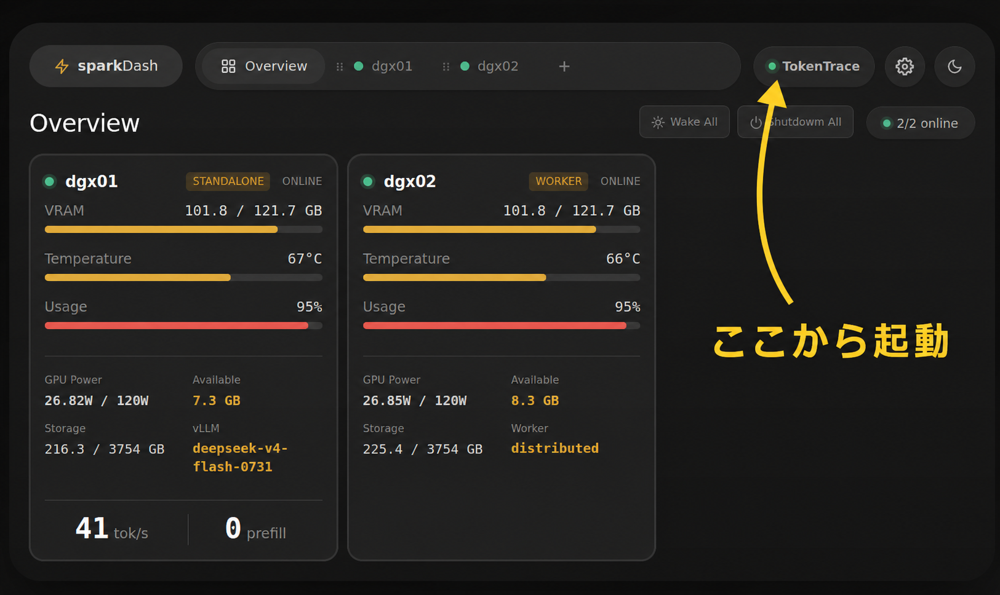
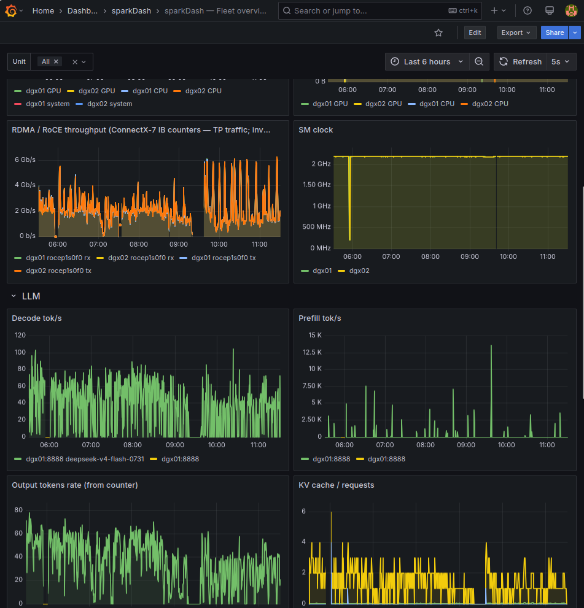

# ultra-sparkdash

[English](#english) · [日本語](#日本語)

[sparkdash-tree]: https://github.com/muojp/sparkDash/tree/f5b3a9c7ddfda4011a728988f5aab4f7671a37e3
[sparkdash-readme]: https://github.com/muojp/sparkDash/blob/f5b3a9c7ddfda4011a728988f5aab4f7671a37e3/README.md
[sparkdash-compose]: https://github.com/muojp/sparkDash/blob/f5b3a9c7ddfda4011a728988f5aab4f7671a37e3/docker-compose.yml
[sparkdash-tokentrace]: https://github.com/muojp/sparkDash/blob/f5b3a9c7ddfda4011a728988f5aab4f7671a37e3/docs/TOKENTRACE.md
[sparkdash-observability]: https://github.com/muojp/sparkDash/blob/f5b3a9c7ddfda4011a728988f5aab4f7671a37e3/docs/OBSERVABILITY.md
[sparkdash-retention]: https://github.com/muojp/sparkDash/blob/f5b3a9c7ddfda4011a728988f5aab4f7671a37e3/docs/OBSERVABILITY.md#retention-and-long-term-dashboards
[sparkdash-prometheus]: https://github.com/muojp/sparkDash/blob/f5b3a9c7ddfda4011a728988f5aab4f7671a37e3/observability/prometheus/prometheus.yml
[deepseek-tree]: https://github.com/muojp/DeepSeek-v4-Flash-DSpark-2x-DGX-Spark/tree/058bc5f27a675fa9199d1b6accdd97cb0e823158
[deepseek-readme]: https://github.com/muojp/DeepSeek-v4-Flash-DSpark-2x-DGX-Spark/blob/058bc5f27a675fa9199d1b6accdd97cb0e823158/README.md

## English

`ultra-sparkdash` turns a **2× NVIDIA DGX Spark** deployment running
DeepSeek-V4-Flash with TP=2 over RoCE into a real-time view of what happens
behind every generated token. It combines the recorded routed-expert activity
with sparkDash machine telemetry and pins the two implementation forks as Git
submodules.

| Submodule | Role |
|---|---|
| [`sparkDash`][sparkdash-tree] | TokenTrace Live UI, read-only tailer, DGX metrics, and optional Prometheus/InfluxDB exporters |
| [`DeepSeek-V4-Flash-DSpark-2x-DGX-Spark`][deepseek-tree] | vLLM V2 expert-routing recorder and subscriber-aware short-interval flushing |

Regular sparkDash features remain available. TokenTrace Live adds a view
specialized for DeepSeek-V4-Flash, TP=2 over RoCE, and MTP-5.

The browser aligns a 43-layer × 256-expert routing map and accepted versus
rejected work with engine-step latency, tok/s, actual token output, routing
continuity, and GPU, RoCE, paging, and NVMe state from both DGX Spark nodes.

[](./docs/images/tokentrace-live-dashboard.png)

*The regular view connects each latest token with the inference step, expert
routing, and machine state that produced it.*

Fullscreen mode renders the same live stream as an FHD canvas derived from the
original video generator. It keeps the expert map, per-node paging, step class,
generated text, and routing continuity visible on one screen.

[](./docs/images/tokentrace-fhd-fullscreen.png)

*The main TokenTrace display works from a read-only local SSD tail without
Prometheus.*

### Clone

```bash
git clone --recurse-submodules https://github.com/muojp/ultra-sparkdash.git
cd ultra-sparkdash
git submodule status
```

If cloned without submodules:

```bash
git submodule update --init --recursive
```

Exact submodule commits are pinned. Run the same update after every `git pull`.

### Architecture and data path

```text
DeepSeek / vLLM V2 runner (Head DGX Spark)
  └─ ~/.cache/huggingface/tokentrace/
       ├─ experts-*.idx.jsonl
       └─ experts-*.u8
              │ read-only tail + shared flock
              ▼
same-host sparkDash :5555
  ├─ /tokentrace                         browser UI
  ├─ local Head metrics                  /proc, /sys, nvidia-smi
  └─ Worker metrics                      persistent SSH session
```

Expert-routing files are read from the Head's local SSD. This path requires no
SSH, Grafana, Prometheus, or InfluxDB. Worker GPU, RoCE, NVMe, and paging metrics
still require SSH from the Head, as in regular sparkDash.

The tailer opens files only while a browser subscribes. A shared lock on its
read-only descriptor tells the DeepSeek recorder to shorten flushing from the
normal 2 seconds to 50 ms. It returns to the normal interval after the last
subscriber disconnects.

### Requirements

- Two NVIDIA DGX Spark nodes configured as Head and Worker
- DeepSeek and sparkDash running on the Head
- Working RoCE and TP=2 inference between the nodes
- Non-interactive Head-to-Worker SSH; key authentication is recommended
- Docker Engine with Compose, or Node.js 22, on the Head
- Linux `flock` from util-linux for real trace files
- A sparkDash unit configured as **Local / Head**, with the Worker linked to it

See the
[`DeepSeek fork README`][deepseek-readme] for
model, NCCL, and container setup.

### Start sparkDash

```bash
cd sparkDash
cp .env.example .env
docker compose up -d --build sparkdash
```

Open sparkDash in a browser, then select **TokenTrace** in the upper-right
corner to launch the live trace view.

[](./docs/images/tokentrace-launch-from-sparkdash.png)

The default Compose setup uses host networking, the host PID namespace, `/proc`,
`/sys`, and a read-only host-root mount. An LLM bound to host `127.0.0.1` is
therefore reachable from sparkDash inside the container.

For access from another machine, set `BIND_HOST` to the Head LAN IP or
`0.0.0.0`. sparkDash exposes unauthenticated SSH and power-control APIs. Keep it
on a trusted LAN or behind an authenticated reverse proxy; never bind it
directly to the public Internet.

#### Worker SSH key

SSH runs inside the sparkDash container and does not automatically use host
keys. Enable the SSH key volume in
[`sparkDash/docker-compose.yml`][sparkdash-compose], then mount a
default key name or set its container path:

```dotenv
SSH_IDENTITY_FILE=/root/.ssh/id_ed25519
```

Configure the Head as `Local` and `Head`, and the Worker as `Worker` with
`workerHeadId` pointing to that Head. Select one cluster explicitly when needed:

```dotenv
TOKENTRACE_HEAD_ID=<sparkDash Head id>
```

### DeepSeek recorder and token output

Enable expert routing before starting inference:

```dotenv
DSPARK_TOKENTRACE_EXPERTS=1
```

Output defaults to `~/.cache/huggingface/tokentrace` for the Head user. Compose
mounts the host root at `/host/root:ro` and infers the path from the Head unit's
SSH user. For root, a non-standard home, or another SSD, set the read-only path
visible inside the container:

```dotenv
TOKENTRACE_DIR=/host/root/path/to/tokentrace
```

Open `http://<Head LAN IP>:5555/tokentrace`.

The default `metadata` mode does not convert token IDs to text. To show actual
tokens, provide `/detokenize` from an OpenAI-compatible server on the same Head:

```dotenv
TOKENTRACE_TOKEN_OUTPUT=detokenize
TOKENTRACE_MODEL=deepseek-v4-flash-0731
TOKENTRACE_DETOKENIZE_URL=http://127.0.0.1:8888/detokenize
```

The sparkDash Compose file explicitly forwards `TOKENTRACE_*`, exporter, and
polling variables because Compose otherwise treats `.env` primarily as an
interpolation file.

### Optional Grafana / Prometheus / InfluxDB

None of these services is required by TokenTrace Live or the regular dashboard.
Start the development mini-stack with:

```bash
cd sparkDash/observability
docker compose up -d
```

The services bind to `127.0.0.1` by default. Prometheus scrapes
`host.docker.internal:5555` on the same Docker host; edit
[`prometheus.yml`][sparkdash-prometheus] for a
different target. Never reuse development Grafana/InfluxDB credentials on an
exposed network. See
[`docs/OBSERVABILITY.md`][sparkdash-observability].

[](./docs/images/grafana-fleet-overview.png)

*The Fleet overview compares RDMA/RoCE throughput, SM clock, token rates, KV
cache, and requests over a longer time range than TokenTrace Live.*

#### Long-term retention

sparkDash itself does not retain time-series history. Keep the optional stack
running to inspect past GPU, RoCE, NVMe, paging, and LLM metrics in Grafana. The
mini-stack defaults to 180-day Prometheus and InfluxDB retention. Data and
Grafana state live in the `prom-data`, `influx-data`, and `grafana-data` named
volumes.

`docker compose down` preserves them; `docker compose down -v` deletes history.
Prometheus applies retention after restart. `DOCKER_INFLUXDB_INIT_RETENTION`
only applies when an InfluxDB bucket is created, so update existing buckets via
the API. See
[`Retention`][sparkdash-retention]
for procedures, sizing, and verification. Back up the volumes and keep Grafana
provisioning under `observability/grafana/provisioning/` in Git.

### GPU clock cap for thermal-throttle avoidance

Clock-cap application and monitoring/export are separate. Each DGX runs
`gb10-clock-cap.service`; sparkDash provides its runtime on/off toggle. The API
only calls `systemctl start` or `stop` and does not change boot enablement, so an
enabled unit applies the cap again after reboot.

The included [`systemd/gb10-clock-cap.service`](./systemd/gb10-clock-cap.service)
is derived from [`agjs/gb10-clock-cap`](https://github.com/agjs/gb10-clock-cap)
under the MIT License, with attribution preserved in
[`THIRD_PARTY_NOTICES.md`](./THIRD_PARTY_NOTICES.md). It carries the 2200 MHz
limit used on dgx01. Confirm an appropriate limit for each machine before
installation:

```bash
sudo install -m 0644 systemd/gb10-clock-cap.service /etc/systemd/system/
sudo systemctl daemon-reload
sudo systemctl enable --now gb10-clock-cap.service
systemctl status gb10-clock-cap.service --no-pager
nvidia-smi --query-gpu=clocks.current.sm,clocks.max.sm --format=csv
```

The unit applies `nvidia-smi -lgc 0,2200` and resets clocks with `-rgc` when
stopped. On GB10, `daemon-reload` while inference was active has caused lost
NVML access and required a container restart. Install before inference; update
an existing unit only in a maintenance window, then verify with `nvidia-smi`.

The sparkDash SSH user needs passwordless sudo for exactly these commands:

```sudoers
sparkdash-user ALL=(root) NOPASSWD: /usr/bin/systemctl start gb10-clock-cap.service, /usr/bin/systemctl stop gb10-clock-cap.service
```

Install with `visudo -f /etc/sudoers.d/gb10-clock-cap`. Do not add `enable`,
`disable`, `restart`, or `daemon-reload`. Do not expose unauthenticated port
5555 to an untrusted network.

```dotenv
CLOCK_CAP_MONITORING=true
POLL_INTERVAL_CLOCK_CAP=60000
```

Control and monitoring use non-interactive SSH even for the Local Head because
container `systemctl` does not access host systemd. `CLOCK_CAP_MONITORING` only
enables periodic snapshots/exporters; it is not required for the UI toggle or
cap application. Optional Grafana/Prometheus can retain the
`gpu_clock_cap_installed`, `gpu_clock_cap_enabled`, `gpu_clock_cap_active`, and
`gpu_clock_cap_sm_clock_mhz` metrics.

### Demo and intentional specialization

Enable machine and TokenTrace simulation independently:

```dotenv
SPARKDASH_DEMO=1
TOKENTRACE_DEMO=1
```

Addresses and SSH users in `observability/demo/sparks.json` are fixtures; the
demo collector never connects to them.

The following values intentionally define this artifact:

- Display: `DeepSeek-V4-Flash · TP=2 over RoCE · MTP-5`
- Routed experts: 256; layers, top-k, and rows come from stream metadata
- FHD canvas: 1920 × 1080
- Recorder format: `experts-*.idx.jsonl` + `.u8`

Generalizing another model requires coordinated producer, regular-view, and
fullscreen changes.

### Release preflight

Push both fork commits before the parent repository. Each submodule's `origin`
and the root `.gitmodules` URL must point to the same public fork containing the
pinned commit.

```bash
git -C sparkDash branch -r --contains HEAD
git -C DeepSeek-v4-Flash-DSpark-2x-DGX-Spark branch -r --contains HEAD
git submodule status
git -C sparkDash status --short
git -C DeepSeek-v4-Flash-DSpark-2x-DGX-Spark status --short
```

The publication branches are:

```bash
git -C sparkDash push -u origin feat/grafana-export
git -C DeepSeek-v4-Flash-DSpark-2x-DGX-Spark push -u origin feat/tokentrace-sparkdash
```

Validate sparkDash before publishing:

```bash
cd sparkDash
npm ci
npm run typecheck
npm run build
npm test
docker compose config --quiet
docker compose -f observability/docker-compose.yml config --quiet
```

### Documentation and license

- [TokenTrace Live][sparkdash-tokentrace]
- [Observability exporters][sparkdash-observability]
- [sparkDash README][sparkdash-readme]
- [DeepSeek fork README][deepseek-readme]

The root repository is distributed under the [MIT License](./LICENSE).
Submodules, model weights, container images, CUDA/NCCL, and other runtime
artifacts retain their own terms. See
[`THIRD_PARTY_NOTICES.md`](./THIRD_PARTY_NOTICES.md).

---

## 日本語

`ultra-sparkdash`は、**NVIDIA DGX Spark 2台**でDeepSeek-V4-FlashをTP=2 over
RoCE実行する構成を、生成tokenの裏側までリアルタイム可視化します。記録した
routed expert情報とsparkDashのmachine telemetryを組み合わせ、2つの実装forkを
Git submoduleとして固定する配布用メタリポジトリです。

| Submodule | 役割 |
|---|---|
| [`sparkDash`][sparkdash-tree] | TokenTrace Live UI、read-only tailer、DGXメトリクス、optionalなPrometheus/InfluxDB exporter |
| [`DeepSeek-V4-Flash-DSpark-2x-DGX-Spark`][deepseek-tree] | vLLM V2 expert-routing recorderとsubscriber接続時の短周期flush |

通常のsparkDash機能はそのまま利用できます。TokenTrace Liveは
DeepSeek-V4-Flash、TP=2 over RoCE、MTP-5構成向けのアドオンです。

通常表示では43層 × 256 expertsのroutingとaccepted / rejected workを、engine step
time、tok/s、実token、routing continuity、2台のGPU・RoCE・paging・NVMe状態と
同じ時系列で追えます。

[](./docs/images/tokentrace-live-dashboard.png)

*最新tokenと、そのtokenを生成した推論step・expert routing・machine stateを
対応付けます。*

fullscreenは同じlive streamを、元の動画generator由来のFHD canvasへ再構成します。

[](./docs/images/tokentrace-fhd-fullscreen.png)

*主要なTokenTrace表示はPrometheusなしでlocal SSDのread-only tailだけでも動きます。*

### Clone

```bash
git clone --recurse-submodules https://github.com/muojp/ultra-sparkdash.git
cd ultra-sparkdash
git submodule status
```

submoduleなしでcloneした場合と`git pull`後は実行してください。

```bash
git submodule update --init --recursive
```

### 構成とデータ経路

```text
DeepSeek / vLLM V2 runner (Head DGX Spark)
  └─ ~/.cache/huggingface/tokentrace/
       ├─ experts-*.idx.jsonl
       └─ experts-*.u8
              │ read-only tail + shared flock
              ▼
same-host sparkDash :5555
  ├─ /tokentrace                         browser UI
  ├─ local Head metrics                  /proc, /sys, nvidia-smi
  └─ Worker metrics                      persistent SSH session
```

expert-routing fileはHeadのlocal SSDから読みます。この経路にSSH、Grafana、
Prometheus、InfluxDBは不要です。WorkerのGPU、RoCE、NVMe、pagingメトリクスには
HeadからWorkerへのSSHが必要です。

browser subscriberがいる間だけtailerがfileを開きます。read-only descriptorの
shared lockを検出するとDeepSeek recorderはflushを通常の2秒から50 msへ短縮し、
最後のsubscriber切断後に通常間隔へ戻します。

### 前提環境

- Head / Workerとして構成したNVIDIA DGX Spark 2台
- Head上で動くDeepSeekとsparkDash
- node間のRoCEとTP=2推論環境
- HeadからWorkerへの非対話SSH。key auth推奨
- Head上のDocker Engine + Compose、またはNode.js 22
- 実trace tail用のLinux `flock`（util-linux）
- **Local / Head**のsparkDash unitと、そこへlinkedしたWorker

model、NCCL、containerの準備は
[`DeepSeek fork README`][deepseek-readme]を参照して
ください。

### sparkDashの起動

```bash
cd sparkDash
cp .env.example .env
docker compose up -d --build sparkdash
```

sparkDashをbrowserで開き、右上の**TokenTrace**を選ぶとlive trace viewを起動
できます。

[](./docs/images/tokentrace-launch-from-sparkdash.png)

標準Composeはhost network、host PID namespace、`/proc`、`/sys`、host rootの
read-only mountを使います。hostの`127.0.0.1`にbindしたLLMへcontainer内から到達
できます。

別端末から接続する場合は`BIND_HOST`をHead LAN IPまたは`0.0.0.0`にします。
sparkDashのSSH・power APIには認証がないため、公開Internetへ直接bindせず、信頼
できるLANまたは認証付きreverse proxy内に限定してください。

#### Worker SSH key

SSHはcontainer内で実行され、host keyを自動参照しません。
[`sparkDash/docker-compose.yml`][sparkdash-compose]のSSH key volumeを
有効化し、default名でmountするかpathを設定します。

```dotenv
SSH_IDENTITY_FILE=/root/.ssh/id_ed25519
TOKENTRACE_HEAD_ID=<sparkDash Head id>
```

Headは`Local`かつ`Head`、Workerは`Worker`かつ`workerHeadId`がHeadを指すように
設定してください。`TOKENTRACE_HEAD_ID`は複数cluster時の対象固定に使います。

### DeepSeek recorderとtoken output

推論開始前にrecorderを有効化します。

```dotenv
DSPARK_TOKENTRACE_EXPERTS=1
```

標準出力先はHead userの`~/.cache/huggingface/tokentrace`です。Composeはhost rootを
`/host/root:ro`へmountし、Head unitのSSH userからpathを推定します。root、非標準
home、別SSDの場合はcontainerから見えるread-only pathを指定します。

```dotenv
TOKENTRACE_DIR=/host/root/path/to/tokentrace
```

`http://<Head LAN IP>:5555/tokentrace`を開いてください。

既定の`metadata` modeはtoken IDを文字列化しません。実token表示には、同じHeadの
OpenAI-compatible serverが提供する`/detokenize`を設定します。

```dotenv
TOKENTRACE_TOKEN_OUTPUT=detokenize
TOKENTRACE_MODEL=deepseek-v4-flash-0731
TOKENTRACE_DETOKENIZE_URL=http://127.0.0.1:8888/detokenize
```

Composeが`.env`を主に置換fileとして扱うため、sparkDash forkは`TOKENTRACE_*`、
exporter、polling変数を明示的にcontainerへ渡します。

### OptionalなGrafana / Prometheus / InfluxDB

TokenTrace Liveにも通常dashboardにも必須ではありません。development mini-stack:

```bash
cd sparkDash/observability
docker compose up -d
```

既定では`127.0.0.1`だけへbindし、Prometheusは同じDocker hostの
`host.docker.internal:5555`をscrapeします。別targetは
[`prometheus.yml`][sparkdash-prometheus]で変更します。
development credentialsを公開networkに流用しないでください。詳細は
[`docs/OBSERVABILITY.md`][sparkdash-observability]にあります。

[](./docs/images/grafana-fleet-overview.png)

*Fleet overviewではRDMA/RoCE、SM clock、token rate、KV cache、requestsを
TokenTrace Liveより長い時間軸で比較できます。*

#### 長期保持

sparkDash本体は時系列を保持しません。過去のGPU、RoCE、NVMe、paging、LLMを
Grafanaで見るにはoptional stackを常時運用します。PrometheusとInfluxDBは180日保持
が既定で、dataとGrafana状態は`prom-data`、`influx-data`、`grafana-data` named
volumeへ保存します。

`docker compose down`では残り、`docker compose down -v`では削除されます。
Prometheus設定は再起動後に反映されます。`DOCKER_INFLUXDB_INIT_RETENTION`はbucket
初回作成時だけ有効なので既存bucketはAPIで変更します。手順と容量目安は
[`Retention`][sparkdash-retention]を
参照し、長期保存時はvolumeをbackupしてください。

### GPU clock cap（thermal throttle回避）

cap適用と監視/exportは別機能です。各DGXの`gb10-clock-cap.service`がclockを変更し、
sparkDashがruntime on/offを提供します。APIは`systemctl start` / `stop`だけを呼び、
boot enablementは変えません。

収録した[`gb10-clock-cap.service`](./systemd/gb10-clock-cap.service)は、MIT Licenseの
[`agjs/gb10-clock-cap`](https://github.com/agjs/gb10-clock-cap)を基にしており、
[`THIRD_PARTY_NOTICES.md`](./THIRD_PARTY_NOTICES.md)に帰属を保持しています。dgx01で
使う2200 MHz上限を含むため、各machineに適切か確認してから導入してください。

```bash
sudo install -m 0644 systemd/gb10-clock-cap.service /etc/systemd/system/
sudo systemctl daemon-reload
sudo systemctl enable --now gb10-clock-cap.service
systemctl status gb10-clock-cap.service --no-pager
nvidia-smi --query-gpu=clocks.current.sm,clocks.max.sm --format=csv
```

unitは`nvidia-smi -lgc 0,2200`を適用し、stop時に`-rgc`で解除します。GB10では推論中
の`daemon-reload`後にNVML accessを失い、container再起動が必要になった事例が
あります。初回導入は推論前、更新はmaintenance windowで行い、最後に
`nvidia-smi`で確認してください。

sparkDash SSH userには次の2コマンドだけをpasswordなしで許可します。

```sudoers
sparkdash-user ALL=(root) NOPASSWD: /usr/bin/systemctl start gb10-clock-cap.service, /usr/bin/systemctl stop gb10-clock-cap.service
```

`visudo -f /etc/sudoers.d/gb10-clock-cap`で導入し、`enable`、`disable`、`restart`、
`daemon-reload`は追加しないでください。port 5555を信頼できないnetworkへ公開しない
でください。

```dotenv
CLOCK_CAP_MONITORING=true
POLL_INTERVAL_CLOCK_CAP=60000
```

Local Headを含む全unitの制御・監視にcontainerからの非対話SSHを使います。
`CLOCK_CAP_MONITORING`は定期snapshot/exporter用で、UI切替やcap適用には不要です。
Grafana/Prometheusは`gpu_clock_cap_installed`、`gpu_clock_cap_enabled`、
`gpu_clock_cap_active`、`gpu_clock_cap_sm_clock_mhz`を長期保持できます。

### Demoと意図的な専用部分

```dotenv
SPARKDASH_DEMO=1
TOKENTRACE_DEMO=1
```

`observability/demo/sparks.json`のaddressとSSH userはfixtureで接続されません。

次は配布対象を表す意図的な固定値です。

- 表示: `DeepSeek-V4-Flash · TP=2 over RoCE · MTP-5`
- routed experts: 256。layer、top-k、rowはstream metadataを使用
- FHD canvas: 1920 × 1080
- recorder: `experts-*.idx.jsonl` + `.u8`

別modelへ一般化する場合はproducerと通常/fullscreen表示を一緒に変更してください。

### 配布前チェック

親repoより先に両forkをpushします。submoduleの`origin`とroot `.gitmodules`は、固定
commitを含む同じ公開forkを指す必要があります。

```bash
git -C sparkDash branch -r --contains HEAD
git -C DeepSeek-v4-Flash-DSpark-2x-DGX-Spark branch -r --contains HEAD
git submodule status
git -C sparkDash status --short
git -C DeepSeek-v4-Flash-DSpark-2x-DGX-Spark status --short
```

公開branch:

```bash
git -C sparkDash push -u origin feat/grafana-export
git -C DeepSeek-v4-Flash-DSpark-2x-DGX-Spark push -u origin feat/tokentrace-sparkdash
```

sparkDashの検証:

```bash
cd sparkDash
npm ci
npm run typecheck
npm run build
npm test
docker compose config --quiet
docker compose -f observability/docker-compose.yml config --quiet
```

### 詳細資料とLicense

- [TokenTrace Live][sparkdash-tokentrace]
- [Observability exporters][sparkdash-observability]
- [sparkDash README][sparkdash-readme]
- [DeepSeek fork README][deepseek-readme]

root repositoryは[MIT License](./LICENSE)です。submodule、model weight、container
image、CUDA/NCCL、その他runtime artifactには個別の条件が適用されます。詳細は
[`THIRD_PARTY_NOTICES.md`](./THIRD_PARTY_NOTICES.md)を参照してください。
